# jp-books

OS・コンパイラ・Web ブラウザ開発のための和書

## 本棚 1 の上段

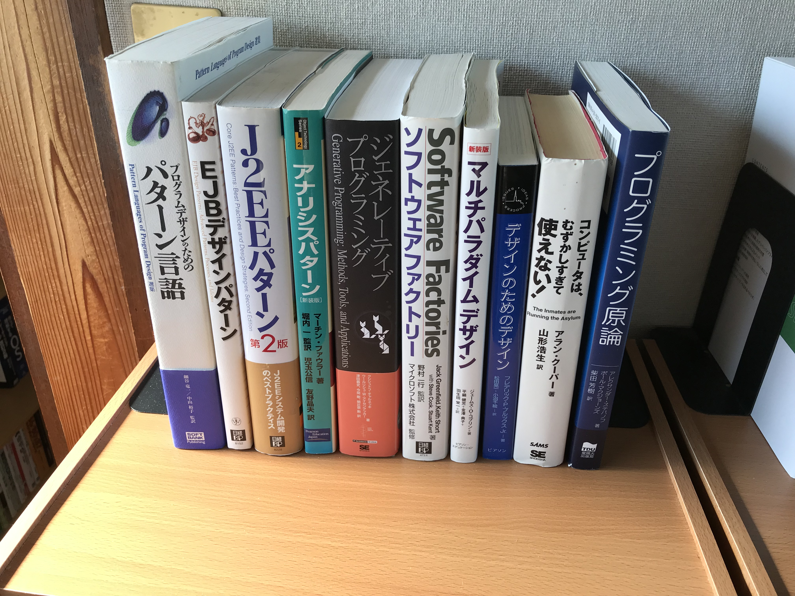

## 本棚 1 の中段

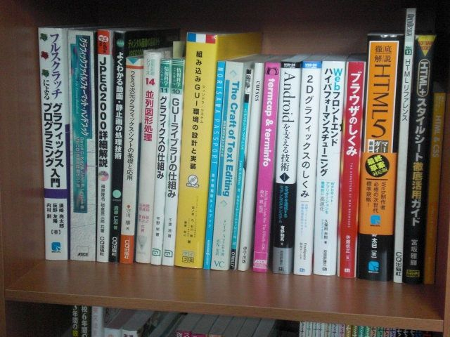

## 本棚 1 の下段

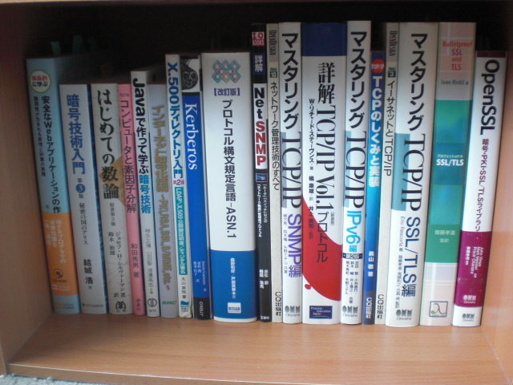

## 本棚 2 の上段

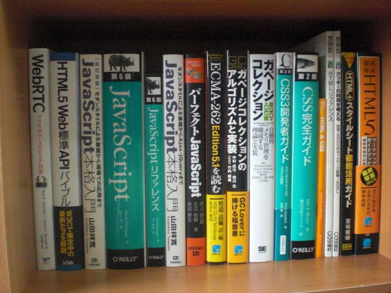

## 本棚 2 の中段

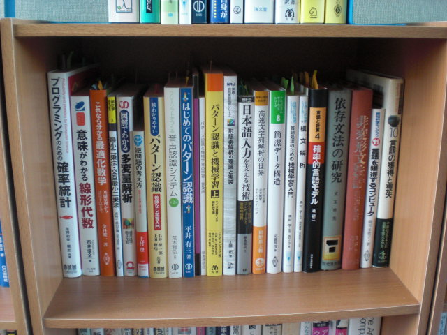

## 本棚 2 の下段

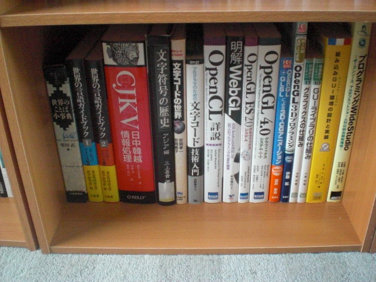

## 本棚 3 の上段

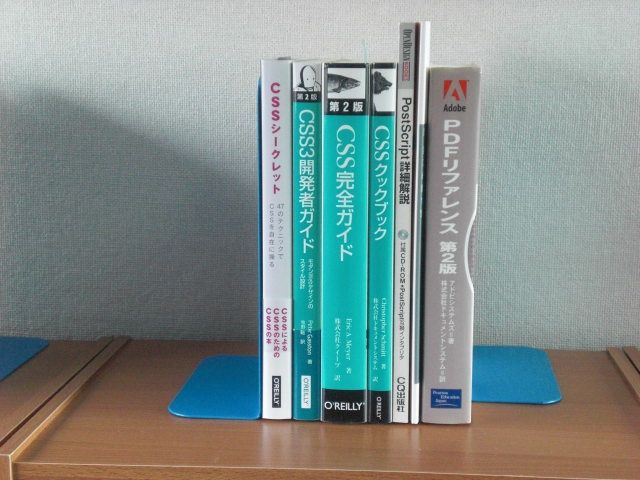

## 本棚 3 の中段

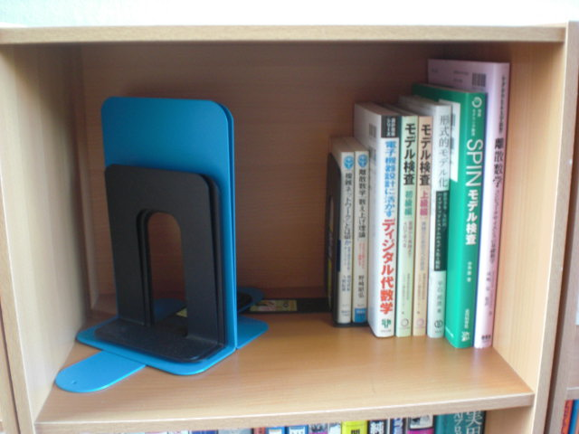

## 本棚 4 の上段

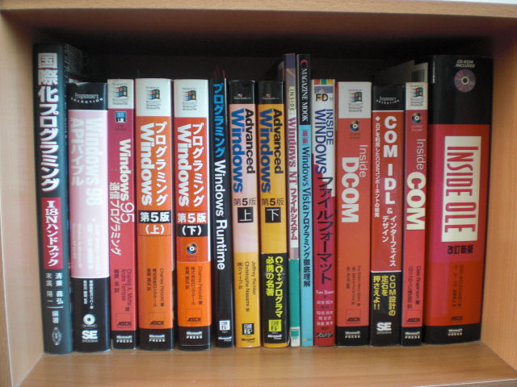

## 本棚 4 の中段

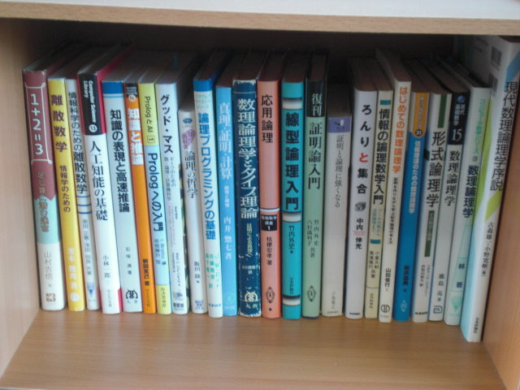

## 本棚 5

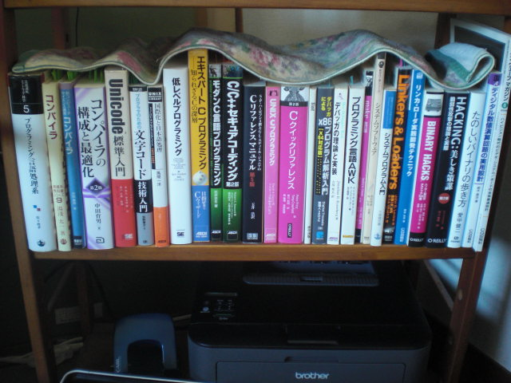

## その他(JIS 規格書)

1. JIS X 3010:2003 プログラム言語C  
2. JIS X 0221:2014 国際符号化文字集合(UCS)  
3. JIS X 4168:2004 段階スタイルシート 水準1(CSS1)  

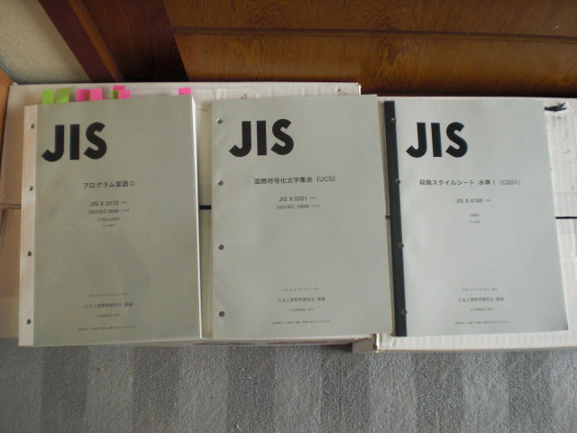

