# jp-books

コンパイラ・IDE・OS・VMM・IME の開発のための和書

2025/06/22 更新

* 2025/06/22 新入荷のある棚：本棚 9 の中段 2・本棚 10 の上段/本棚 12 の中段 2/下段 2/下段 4・本棚 13
* 2025/06/22 背表紙不鮮明や、書名が見えない本について、書名を追記
* 2025/06/22 可能な範囲で、分野別に整理
* 2025/06/22 追加：本棚 13
* 2025/06/22 上段 更新：本棚 4・本棚 5・本棚 8・本棚 9・本棚 10・本棚 11
* 2025/06/22 中段 更新：本棚 11
* 2025/06/22 中段 1 更新：本棚 3・本棚 8・本棚 9・本棚 10
* 2025/06/22 中段 2 更新：本棚 1・本棚 2・本棚 8・本棚 9・本棚 10・本棚 12
* 2025/06/22 下段 更新：本棚 7・本棚 8・本棚 9・本棚 10
* 2025/06/22 下段 2 更新：本棚 12
* 2025/06/22 下段 4 更新：本棚 12
* 2025/04/30 中段 2 追加：本棚 10
* 2025/04/30 下段 追加：本棚 10
* 2025/04/30 下段 3 追加：本棚 12
* 2025/04/30 下段 5 追加：本棚 12
* 2025/04/30 上段 更新：本棚 7・本棚 10・本棚 11
* 2025/04/30 中段 1 更新： 本棚 1・本棚 10
* 2025/04/30 中段 更新：本棚 11
* 2025/04/30 中段 1 の上段 更新：本棚 12
* 2025/04/30 下段 1 更新：本棚 12
* 2025/04/30 下段 2 更新：本棚 12
* 2025/04/30 下段 4 更新：本棚 12

以下で公開しているブックマークの「物品・サービス/書籍」フォルダと  
「物品・サービス/規格」フォルダを見ていただくと、全部ではないですが、  
出版社の書籍案内ページがブックマークされています。

tenpoku1000/OPML_bookmarks: コンパイラ・IDE・OS・VMM・IME の開発のための OPML・ブックマーク HTML ファイル  
https://github.com/tenpoku1000/OPML_bookmarks

## 本棚 1 の上段

## 本棚 1 の中段 1

## 本棚 1 の中段 2

## 本棚 1 の下段

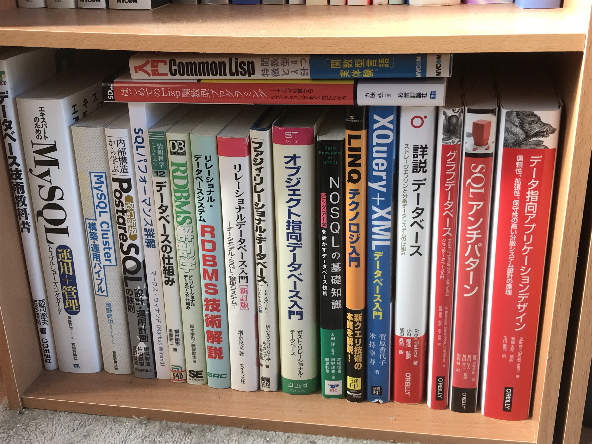

## 本棚 2 の上段

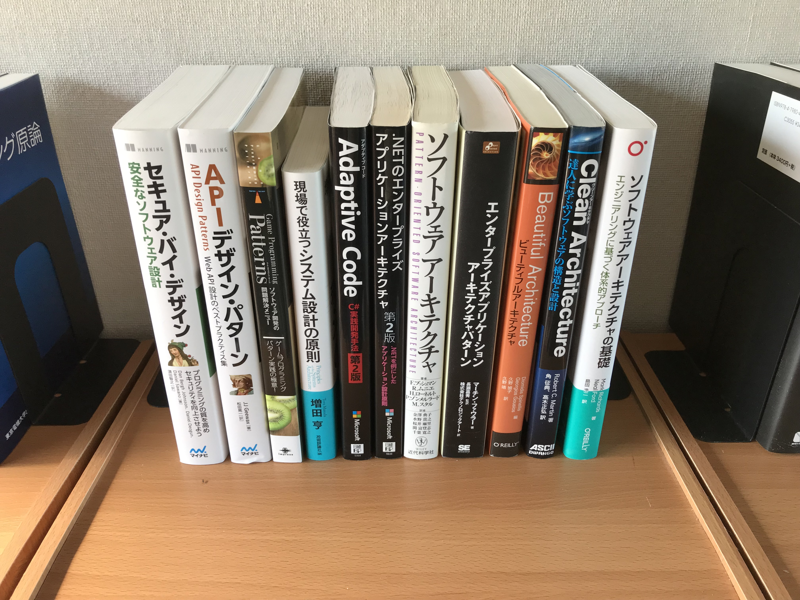

## 本棚 2 の中段 1

## 本棚 2 の中段 2

## 本棚 2 の下段

## 本棚 3 の上段

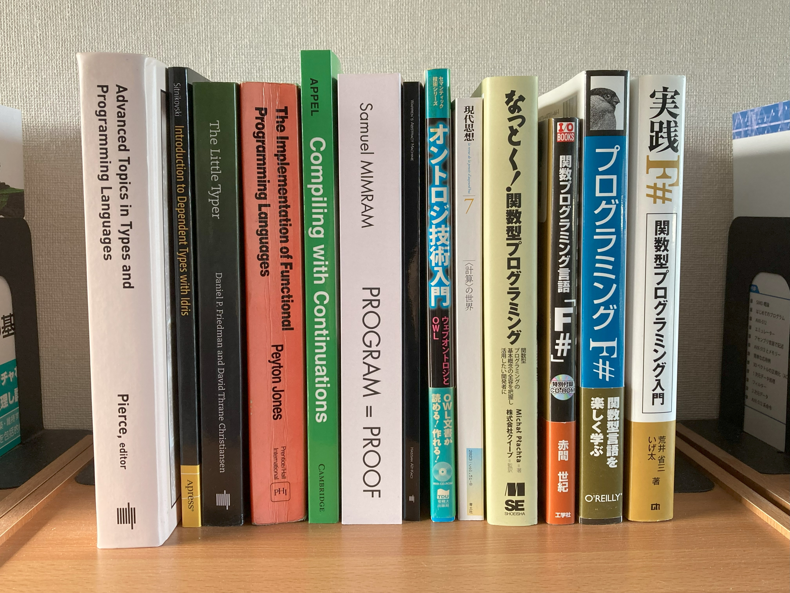

## 本棚 3 の中段 1

## 本棚 3 の中段 2

## 本棚 3 の下段

## 本棚 4 の上段

1. デザインパターンプログラミング

## 本棚 4 の中段 1

1. 非変形文法 娘依存の理論

## 本棚 4 の中段 2

1. word2vecによる自然言語処理

## 本棚 4 の下段

## 本棚 5 の上段

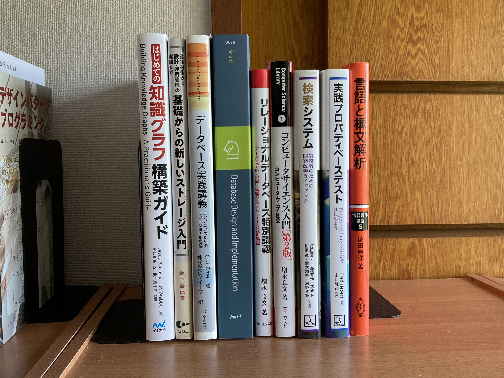

## 本棚 5 の中段 1

## 本棚 5 の中段 2

## 本棚 5 の下段

## 本棚 6 の上段

なし

## 本棚 6 の中段 1

## 本棚 6 の中段 2

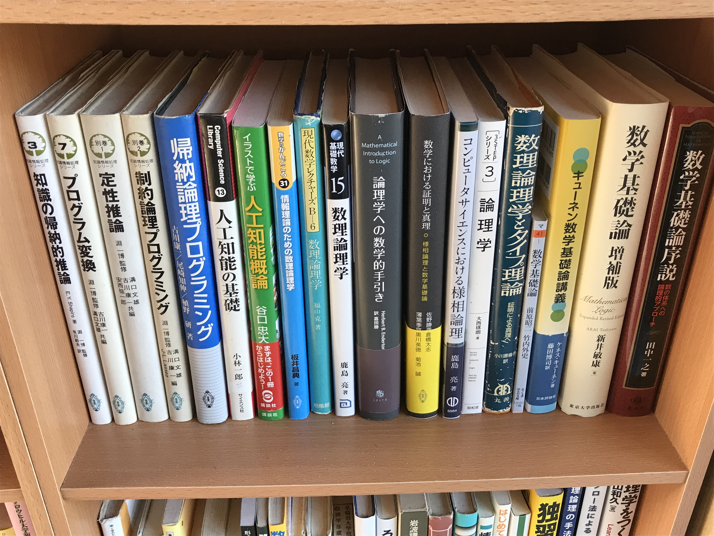

## 本棚 6 の下段

## 本棚 7 の上段

## 本棚 7 の中段 1

1. HTML&CSS―HTML4.01&CSS2対応 (速効!ポケットマニュアル)

## 本棚 7 の中段 2

1. curses (UNIXユーティリティライブラリ)
2. viデスクトップリファレンス

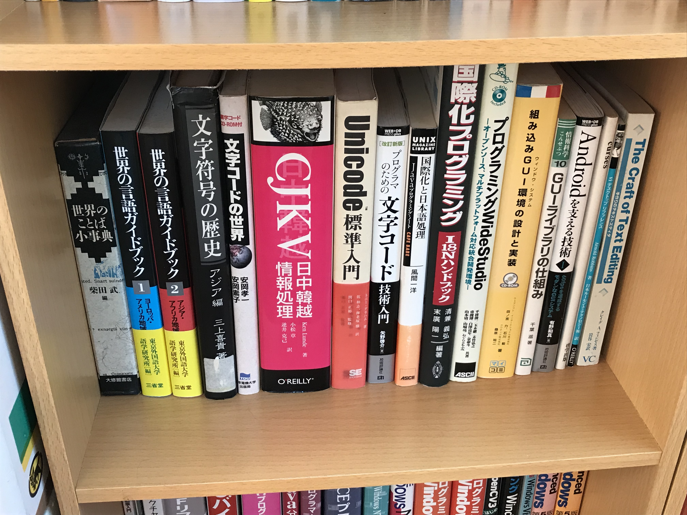

## 本棚 7 の下段

1. Jetpack ComposeによるAndroid MVVMアーキテクチャ入門
2. タグ付きPDF 仕組と制作方法解説
3. 超並列演算器 NVIDIA GPU入門

## 本棚 8 の上段

## 本棚 8 の中段 1

## 本棚 8 の中段 2

## 本棚 8 の下段

## 本棚 9 の上段

## 本棚 9 の中段 1

## 本棚 9 の中段 2

1. MVSの機能と構造

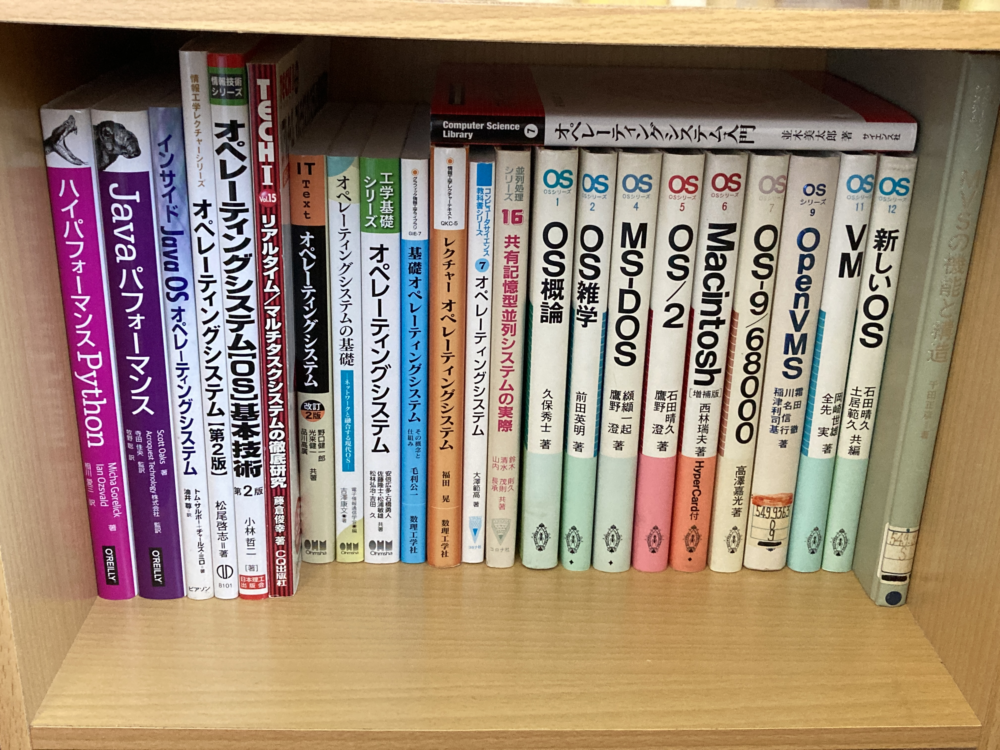

## 本棚 9 の下段

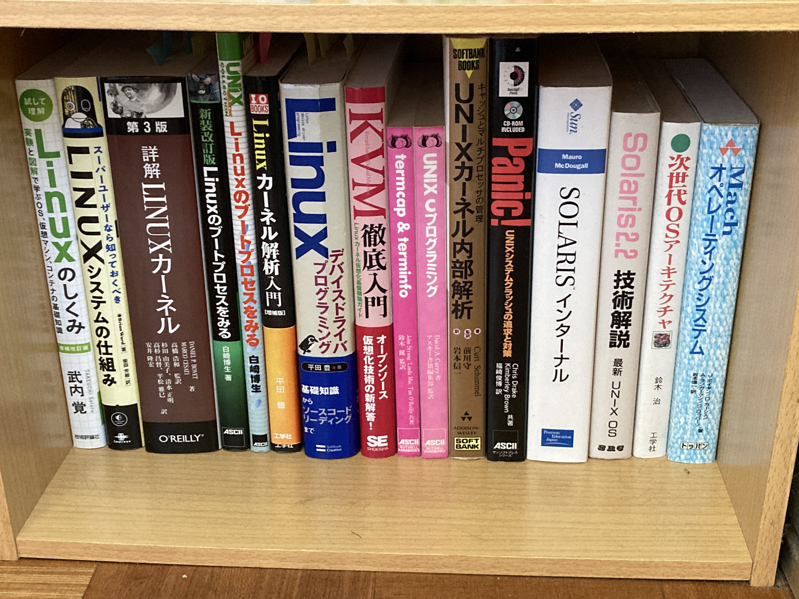

## 本棚 10 の上段

## 本棚 10 の中段 1

## 本棚 10 の中段 2

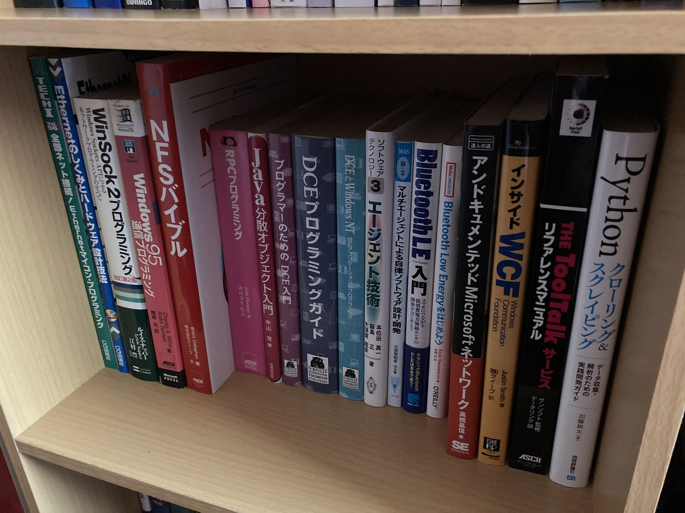

## 本棚 10 の下段

## 本棚 11 の上段

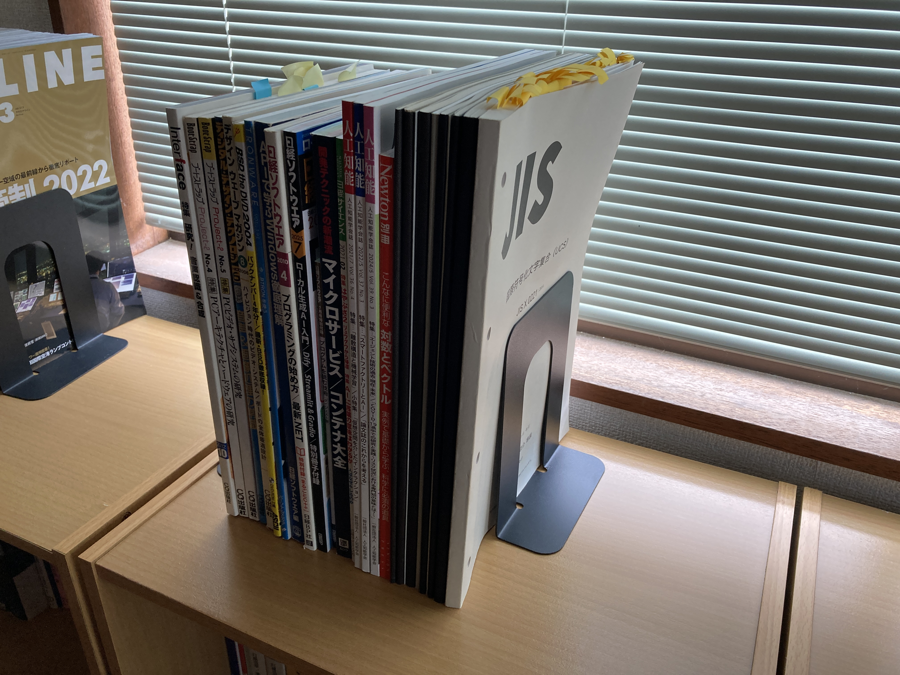

## 本棚 11 の中段

## 本棚 11 の下段

## 本棚 12 の上段

なし

## 本棚 12 の中段 1 の上段

## 本棚 12 の中段 1 の下段

1. レクチャーノート／ソフトウェア学 1 型理論：近代科学社

## 本棚 12 の中段 2

## 本棚 12 の下段 1

## 本棚 12 の下段 2

## 本棚 12 の下段 3

## 本棚 12 の下段 4

 1. 数学セミナー 2008年11月号 計算の品質 精度・誤差・効率 
 2. 数学セミナー 2009年12月号 計算量の現在 
 3. 数学セミナー 2010年06月号 これがわかれば大学数学が 2^6 倍楽しくなる 
 4. 数学セミナー 2010年09月号 数学を発展させるコンピュータソフト
 5. 数学セミナー 2010年10月号「実解析」とは何か 
 6. 数学セミナー 2011年02月号 ランダムネスを捕まえる 
 7. 数学セミナー 2011年05月号 大学数学が一望できる数学ランドへようこそ(その1)
 8. 数学セミナー 2011年06月号 大学数学が一望できる数学ランドへようこそ(その2)
 9. 科学 2022年11月号 チューリング賞 ドンガラ氏インタビュー
10. 科学 2023年11月号 チューリング賞 2022
11. 科学 2024年11月号 チューリング賞 2023
12. 本の雑誌 2022年10月号 あなたの知らない索引の世界
13. インターネットのカタチ もろさが織り成す粘り強い世界
14. プロジェクトX 挑戦者たち 国産コンピューター ゼロからの大逆転
15. プロジェクトX 挑戦者たち 運命の最終テスト ～ワープロ・日本語に挑んだ若者たち～
16. プロジェクトX 挑戦者たち 家電革命 トロンの衝撃

## 本棚 12 の下段 5

## 本棚 13 の上段

1. JIS X 0221:2014 国際符号化文字集合(UCS) 別添 CD-ROM
2. プロジェクトX 挑戦者たち 執念が生んだ新幹線 〜老友90歳・飛行機が姿を変えた〜
3. ハタダ栗タルト物語 創業から、タルトに栗を入れるまで

## 本棚 13 の中段 1

1. 新体系・高校数学の教科書 上
2. n月刊ラムダノート Vol.1, No.1(2019) ～ Vol.5, No.1(2025)

## 本棚 13 の中段 2

## 本棚 13 の下段

## その他(JIS 規格票：写真は、JIS X 3010:2003 プログラム言語C)

1. JIS X 3010:2003 プログラム言語C  
2. JIS X 0221:2014 国際符号化文字集合(UCS)  
3. JIS X 4156:2005 ハイパテキストマーク付け言語(HTML)  
4. JIS X 4168:2004 段階スタイルシート 水準1(CSS1)  
5. JIS X 8341-1:2010 高齢者・障害者等配慮設計指針―情報通信における機器，ソフトウェア及びサービス―第１部：共通指針
6. JIS X 8341-3:2016 高齢者・障害者等配慮設計指針―情報通信における機器，ソフトウェア及びサービス―第３部：ウェブコンテンツ
7. JIS X 5603:1990 開放型システム間相互接続の抽象構文記法1(ASN.1)仕様  
8. JIS X 3061:2021 JSON データ交換フォーマット
9. JIS X 0606:1998 情報交換用 CD-ROM のボリューム構造及びファイル構造
10. JIS X 0611:2018 ユニバーサルディスクフォーマット(UDF) 2.01
11. JIS X 6235:2015 DVD-レコーダブルディスク(DVD-R)のボリューム構造及びファイル構造

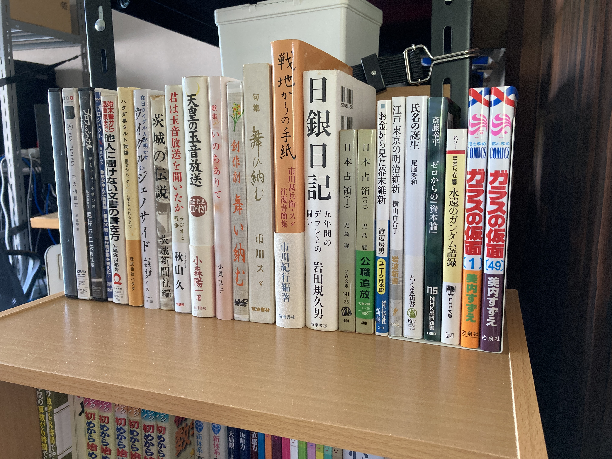

