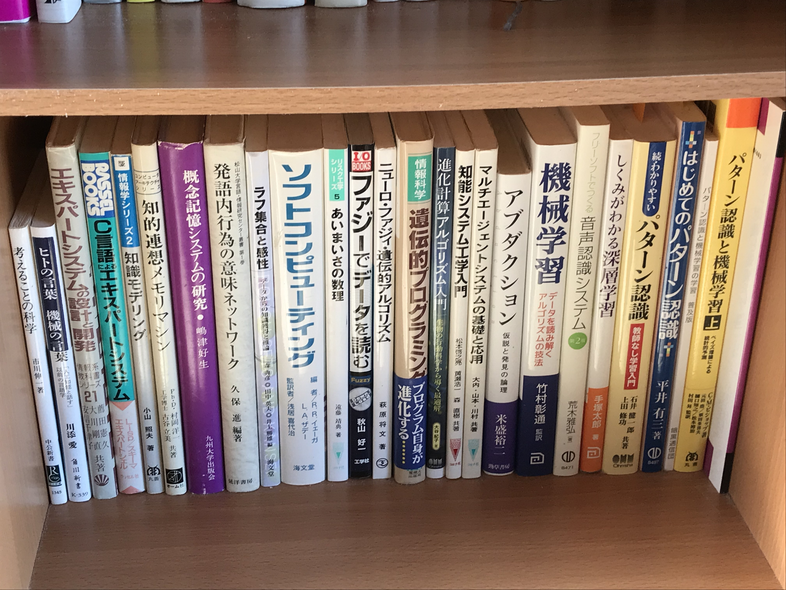
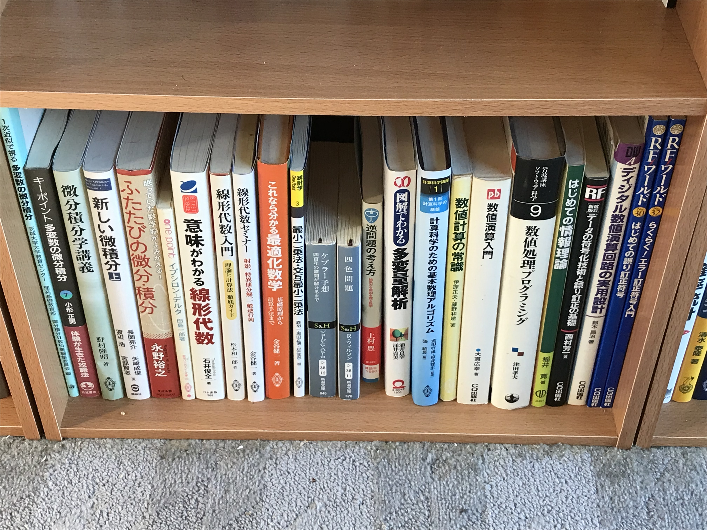
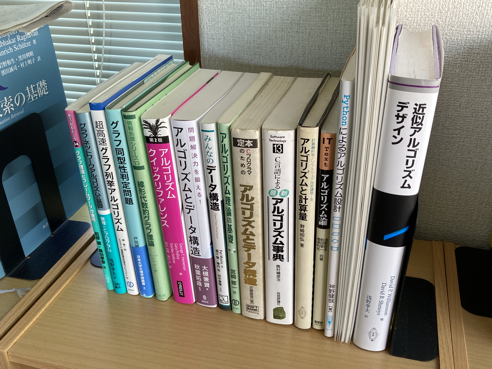
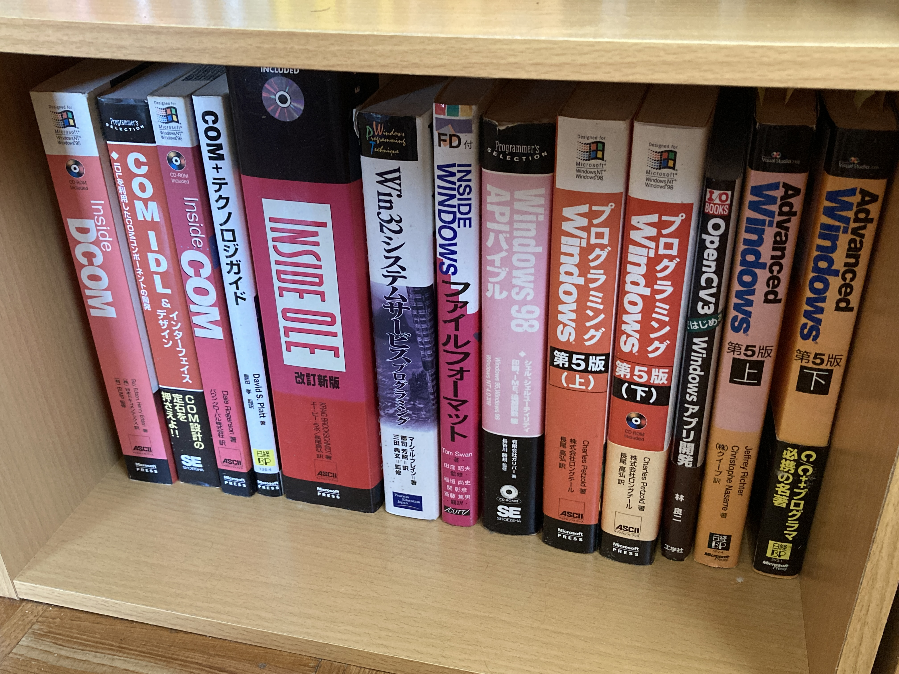
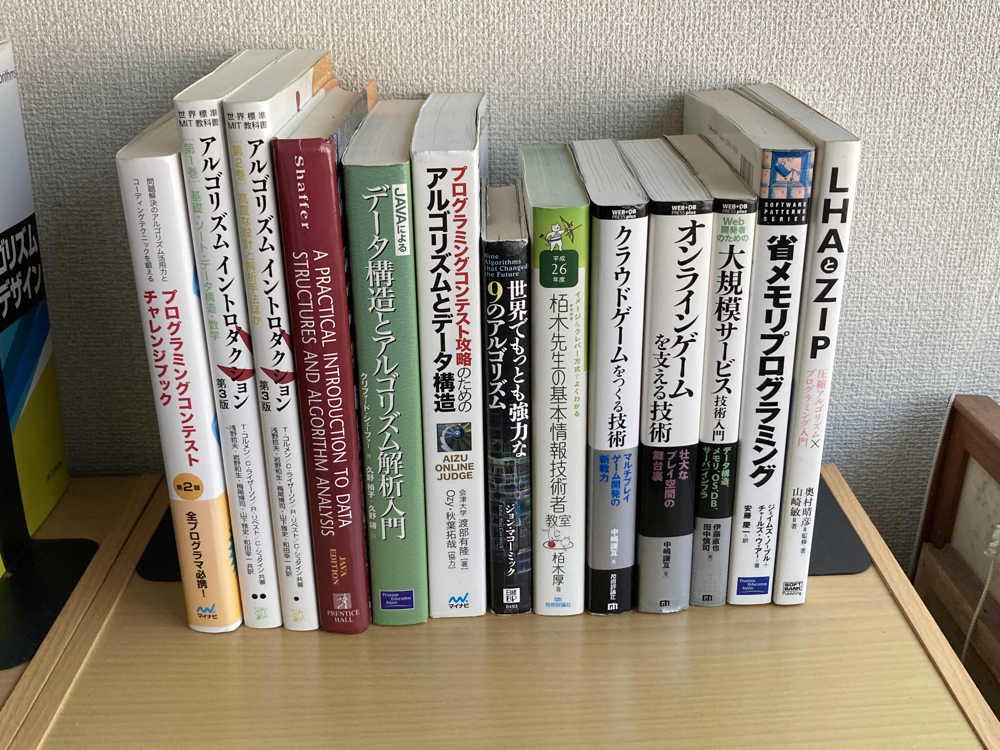
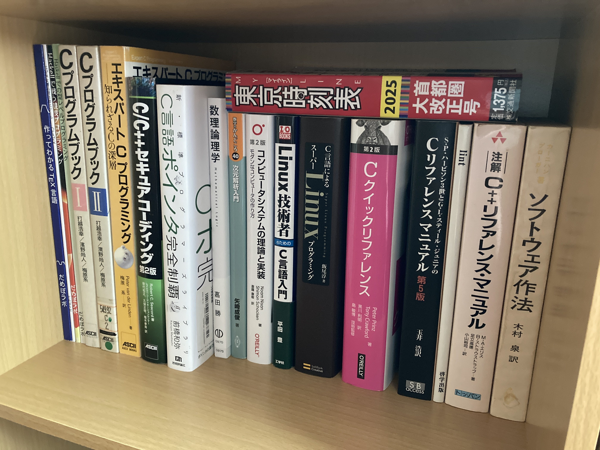
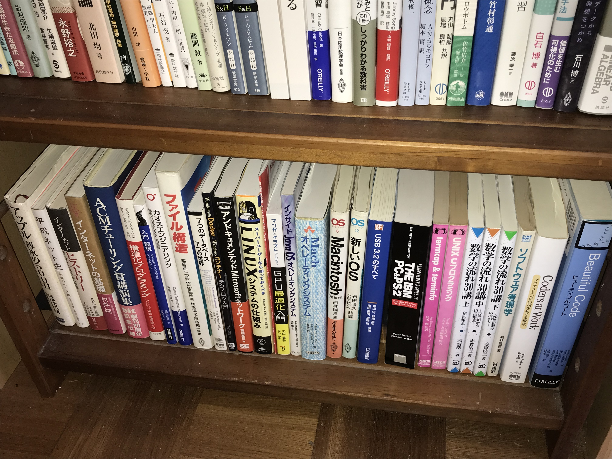

# jp-books

コンパイラ・IDE・OS・VMM・IME の開発のための和書

2024/01/22 更新

* 2024/01/22 上段 更新：本棚 3, 9, 11
* 2024/01/22 中段 1 更新：本棚 1
* 2024/01/22 下段 2 更新：本棚 12
* 2023/12/21 上段 追加：本棚 11
* 2023/12/21 上段 更新：本棚 3, 5, 9
* 2023/12/21 中段 1 更新：本棚 1
* 2023/12/21 名称変更(移動)：本棚 12 の下段 2 -> 本棚 12 の下段 3
* 2023/12/21 本棚 12 の下段 1 を分割：本棚 12 の下段 1, 2

以下で公開しているブックマークの「書籍」フォルダと「規格/規格」フォルダを見ていただくと、  
全部ではないですが、出版社の書籍案内ページがブックマークされています。

tenpoku1000/OPML_bookmarks: コンパイラ・IDE・OS・VMM・IME の開発のための OPML・ブックマーク HTML ファイル  
https://github.com/tenpoku1000/OPML_bookmarks

## 本棚 1 の上段

## 本棚 1 の中段 1

## 本棚 1 の中段 2

## 本棚 1 の下段

## 本棚 2 の上段

## 本棚 2 の中段 1

## 本棚 2 の中段 2

## 本棚 2 の下段

## 本棚 3 の上段

## 本棚 3 の中段 1

## 本棚 3 の中段 2

## 本棚 3 の下段

## 本棚 4 の上段

## 本棚 4 の中段 1

## 本棚 4 の中段 2

## 本棚 4 の下段

## 本棚 5 の上段

## 本棚 5 の中段 1

## 本棚 5 の中段 2

## 本棚 5 の下段

## 本棚 6 の上段

なし

## 本棚 6 の中段 1

## 本棚 6 の中段 2

## 本棚 6 の下段

## 本棚 7 の上段

## 本棚 7 の中段 1

## 本棚 7 の中段 2

## 本棚 7 の下段

## 本棚 8 の上段

## 本棚 8 の中段 1

## 本棚 8 の中段 2

## 本棚 8 の下段

## 本棚 9 の上段

## 本棚 9 の中段 1

## 本棚 9 の中段 2

## 本棚 9 の下段

## 本棚 10 の上段

## 本棚 10 の中段 1

## 本棚 10 の中段 2

なし

## 本棚 10 の下段

なし

## 本棚 11 の上段

## 本棚 11 の中段

## 本棚 11 の下段

## 本棚 12 の上段

なし

## 本棚 12 の中段 1 の上段

## 本棚 12 の中段 1 の下段

## 本棚 12 の中段 2

## 本棚 12 の下段 1

## 本棚 12 の下段 2

## 本棚 12 の下段 3

## その他(JIS 規格書：写真は、JIS X 3010:2003 プログラム言語C)

1. JIS X 3010:2003 プログラム言語C  
2. JIS X 0221:2014 国際符号化文字集合(UCS)  
3. JIS X 5603:1990 開放型システム間相互接続の抽象構文記法1(ASN.1)仕様  
4. JIS X 4156:2005 ハイパテキストマーク付け言語(HTML)  
5. JIS X 4168:2004 段階スタイルシート 水準1(CSS1)  
6. JIS X 3061:2021 JSON データ交換フォーマット
7. JIS X 6235:2015 DVD-レコーダブルディスク(DVD-R)のボリューム構造及びファイル構造
8. JIS X 0606:1998 情報交換用 CD-ROM のボリューム構造及びファイル構造

