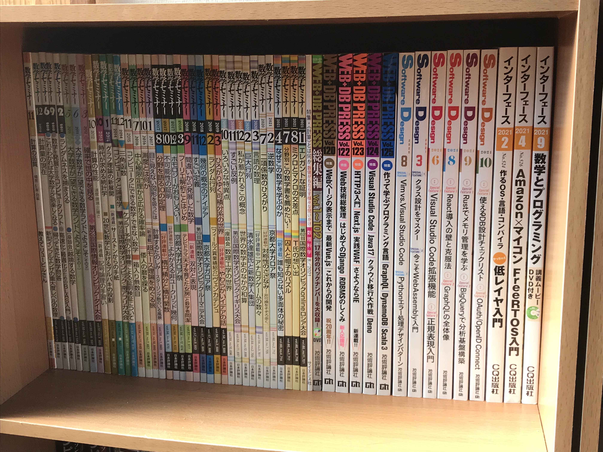
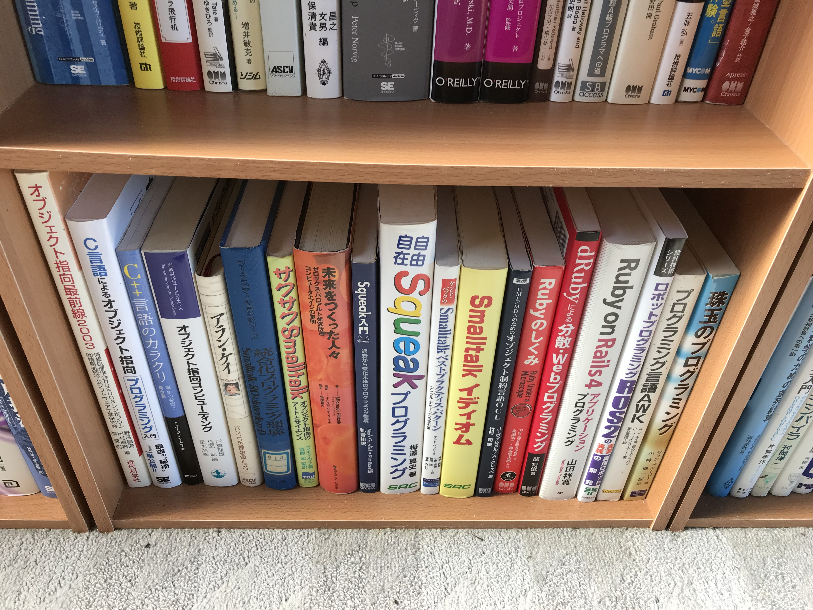
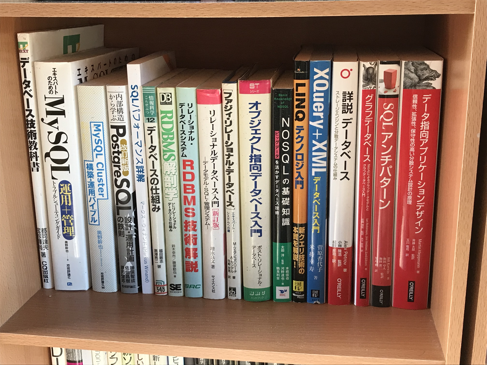
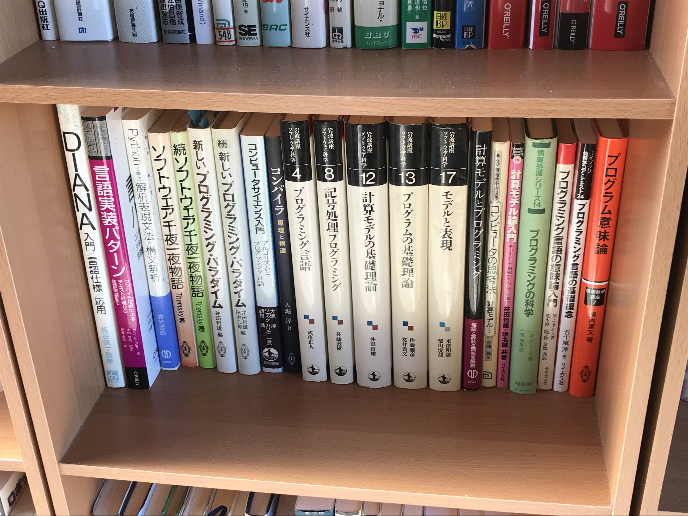
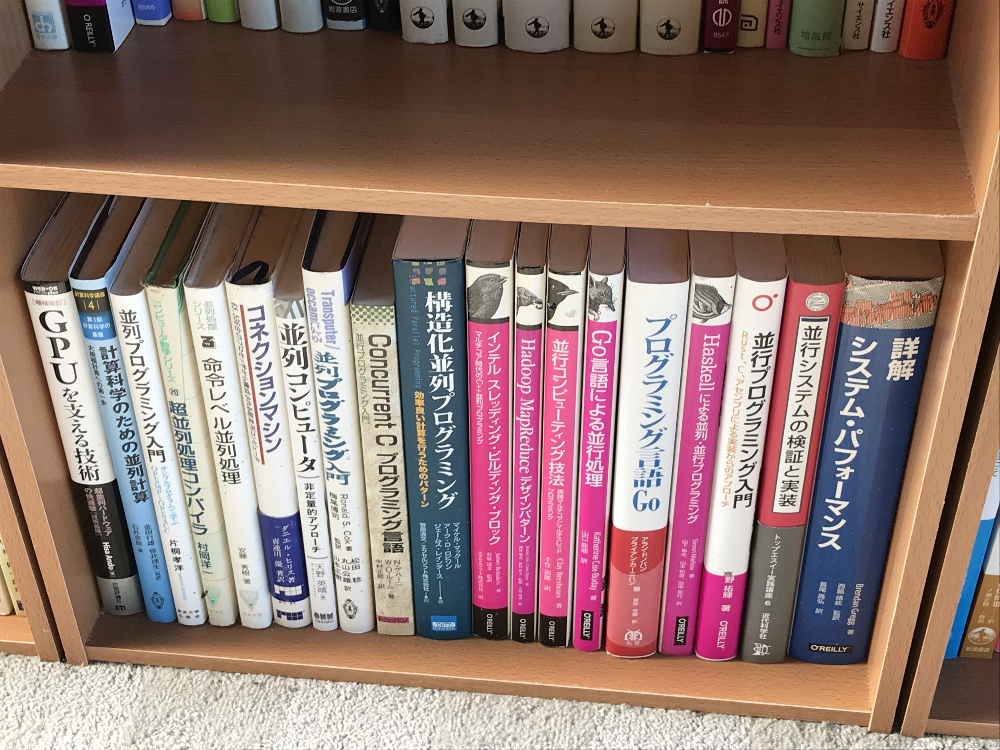
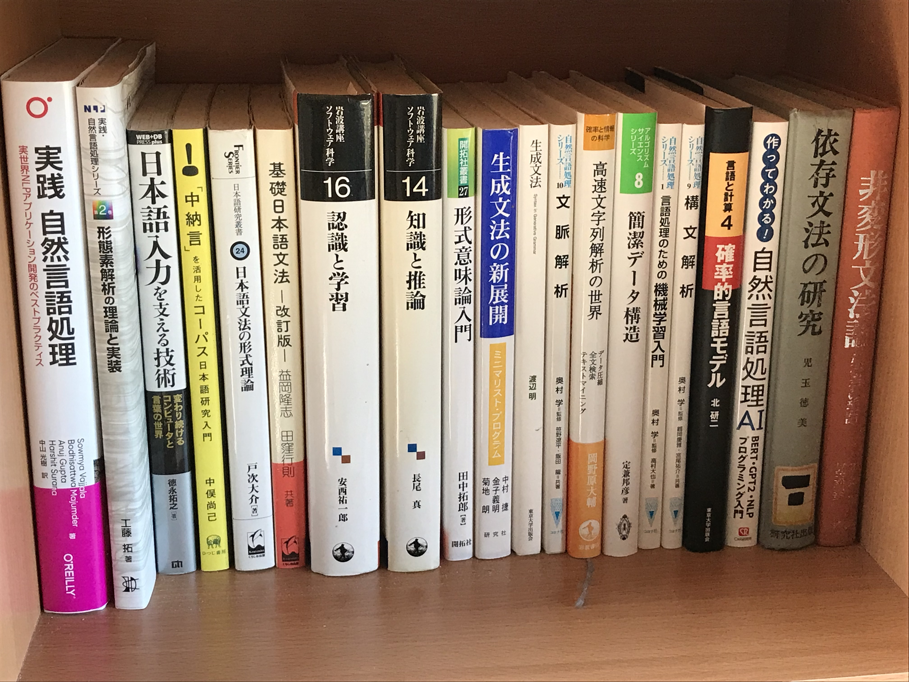
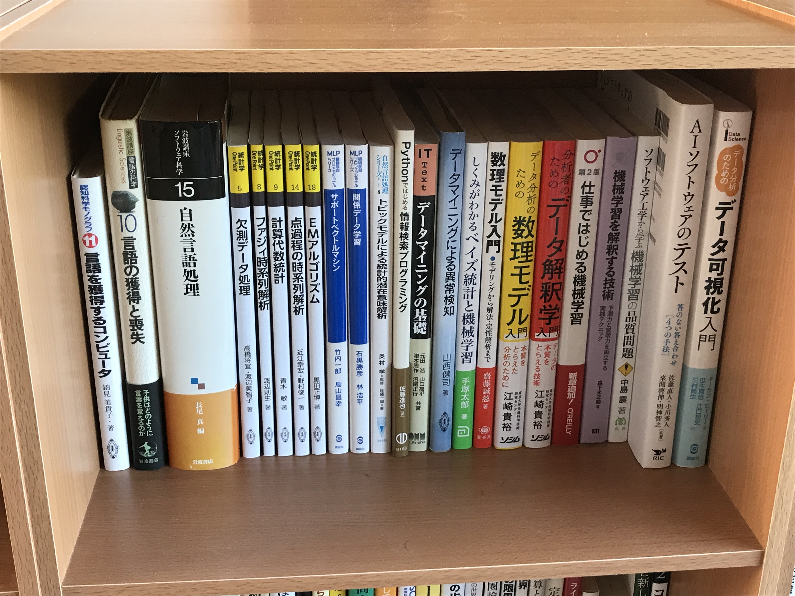
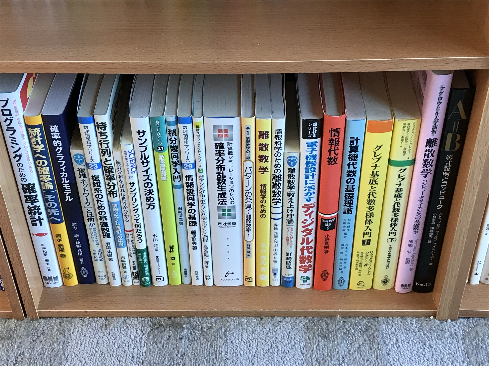
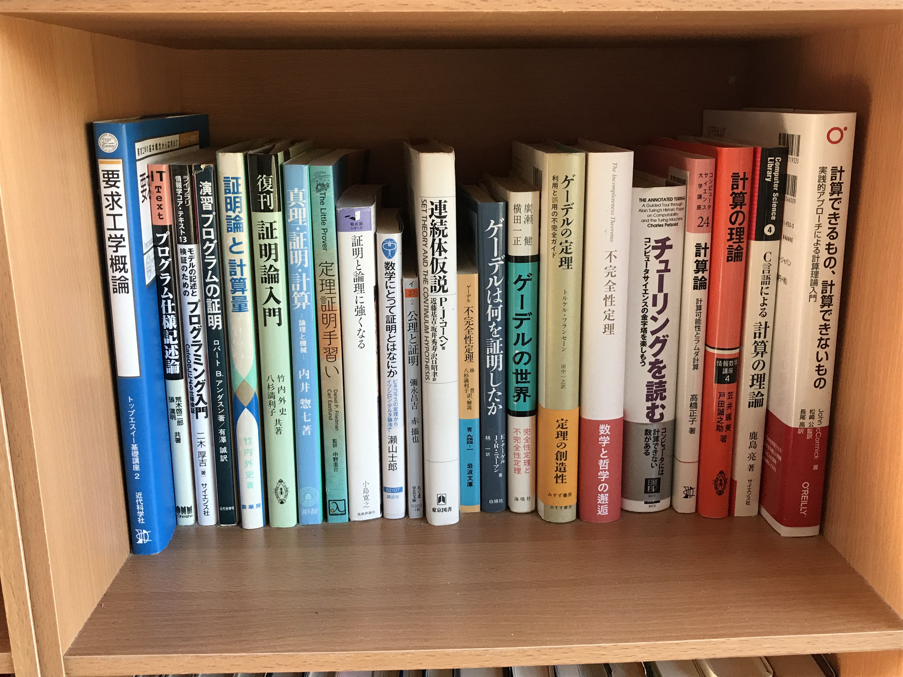
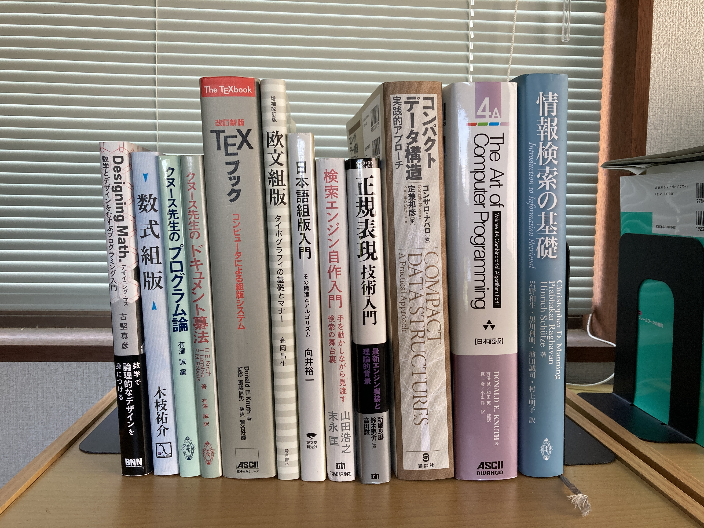

# jp-books

コンパイラ・IDE・OS・VMM・IME の開発のための和書

2020/09/15 更新

## 本棚 1 の上段

## 本棚 1 の中段 1

## 本棚 1 の中段 2

## 本棚 1 の下段

## 本棚 2 の上段

## 本棚 2 の中段 1

## 本棚 2 の中段 2

## 本棚 2 の下段

## 本棚 3 の上段

## 本棚 3 の中段 1

## 本棚 3 の中段 2

## 本棚 3 の下段

## 本棚 4 の上段

なし

## 本棚 4 の中段 1

## 本棚 4 の中段 2

## 本棚 4 の下段

## 本棚 5 の上段

なし

## 本棚 5 の中段 1

## 本棚 5 の中段 2

## 本棚 5 の下段

## 本棚 6 の上段

## 本棚 6 の中段 1

## 本棚 6 の中段 2

## 本棚 6 の下段

なし

## その他(JIS 規格書)

1. JIS X 5603:1990 開放型システム間相互接続の抽象構文記法1(ASN.1)仕様  
2. JIS X 4156:2005 ハイパテキストマーク付け言語(HTML)  
3. JIS X 4168:2004 段階スタイルシート 水準1(CSS1)  

4. JIS X 3010:2003 プログラム言語C  
5. JIS X 0221:2014 国際符号化文字集合(UCS)  

